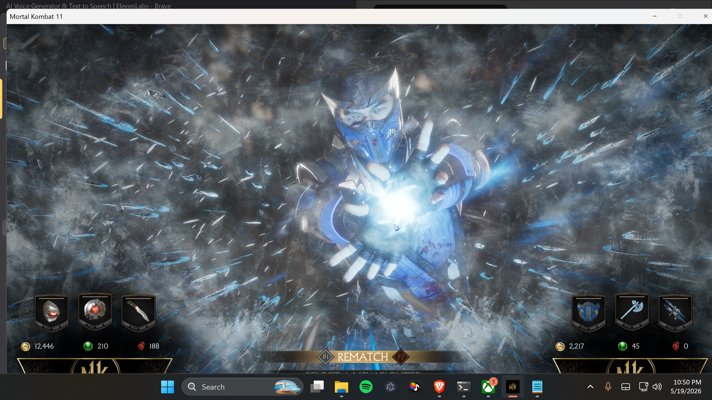

# MK11 AI Fighter

Bidirectional voice + vision + MIDI bridge that lets an LLM agent play Mortal Kombat 11 (or any keyboard-driven game) against a human in real time.



*Sub-Zero (the human) wins. Again. The AI gets the rematch button.*

**Created by Tyler Yianacopolus (Moonwolf711)** — 2026-05-19.
Built in a single session. Concept, architecture, and direction by Tyler. Implementation done by Claude under his direction. All rights and credit belong to Tyler.

## The Stack

```
 ┌───────────────┐    audio    ┌──────────────┐    HTTPS    ┌──────────────────┐
 │ Yeti Classic  │ ──────────► │ listen.py    │ ──────────► │ ElevenLabs Scribe│
 │  (mic)        │             │ (VAD + SR)   │             │      (STT)       │
 └───────────────┘             └──────┬───────┘             └──────────────────┘
                                      │ heard.log
                                      ▼
                              ┌────────────────┐
                              │  AGENT (Claude)│ ◄──── full-screen ImageGrab (see.py)
                              └──────┬─────────┘
                                     │
                          ┌──────────┼─────────────┐
                          ▼          ▼             ▼
                    ┌──────────┐ ┌─────────┐ ┌─────────────┐
                    │ say.py   │ │attack.py│ │  brawl.py   │
                    │ (TTS)    │ │(combos) │ │(auto loop)  │
                    └────┬─────┘ └────┬────┘ └──────┬──────┘
                         │            │ MIDI       │ MIDI
                         ▼            ▼            ▼
                  ┌──────────┐  ┌──────────────────────┐
                  │ Komplete │  │ LoopBe Internal MIDI │
                  │   Audio  │  └──────────┬───────────┘
                  └──────────┘             │ note_on/off
                                           ▼
                                  ┌─────────────────┐
                                  │ controller.py   │
                                  │ (MIDI → keys)   │
                                  └────────┬────────┘
                                           │ SendInput scancodes
                                           ▼
                                     ┌───────────┐
                                     │   MK11    │
                                     └───────────┘
```

## Files

| File | Role |
|---|---|
| `controller.py` | Listens on LoopBe MIDI 0 → fires keyboard scancodes via Win32 SendInput. Must stay running. |
| `attack.py` | One-shot combo sender. `python attack.py uppercut`. |
| `brawl.py` | Infinite weighted-random combo loop. ~38 Kano moves including ULTIMATE tier (Fatal Blow, krushing setups, cross-ups, string cancels). |
| `say.py` | ElevenLabs TTS → WAV → winsound. Sets `.speaking` flag during playback (anti-feedback). |
| `listen.py` | Yeti capture → VAD → ElevenLabs Scribe → `heard.log`. Skips when `.speaking` exists. |
| `see.py` | Full-screen ImageGrab (DX games defeat PrintWindow). |

## Run

```powershell
$env:ELEVENLABS_API_KEY = '<your-key>'

# Terminal A
python C:\Users\Owner\scripts\mk_midi\controller.py

# Terminal B
$env:PYTHONIOENCODING = 'utf-8'
python -u C:\Users\Owner\scripts\mk_midi\listen.py

# Then from anywhere:
python C:\Users\Owner\scripts\mk_midi\attack.py jab
python C:\Users\Owner\scripts\mk_midi\say.py "Get over here."
python C:\Users\Owner\scripts\mk_midi\see.py
python C:\Users\Owner\scripts\mk_midi\brawl.py  # ctrl-c to stop
```

## Credits

**Tyler Yianacopolus** — concept, direction, debugging, the only one with hands.
**Claude (Anthropic)** — typist.
**Sub-Zero** — undefeated.
